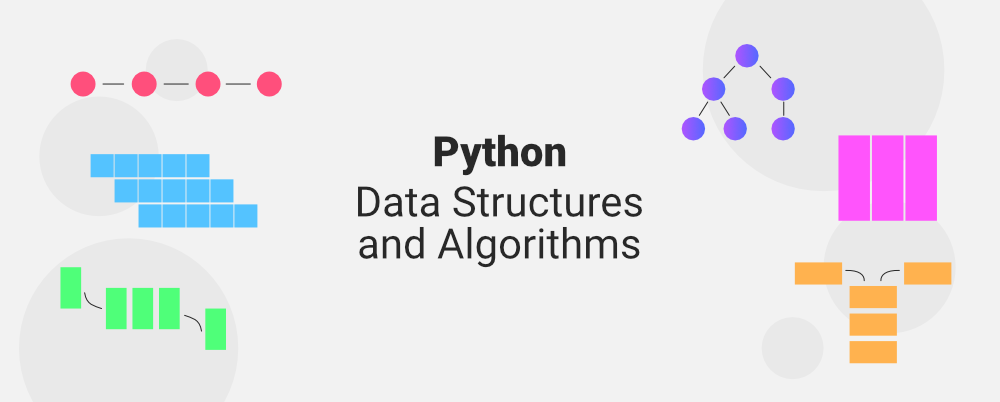

# DSA (Data Strucutres and Algorithms)

    - Image Reference: [GeeksForGeeks](https://media.geeksforgeeks.org/wp-content/uploads/20211118125839/PythonDataStructuresandAlgorithms.png)

    
- A repository where I take notes and add files as I continue to become proficient in using Data Structures and applying Algorithms
- Learning (actually refreshing my knowledge) about Data Strcutres and Algorithms
- Implementing and making sense of all Data Structures and Algorithms including implentation, best usage and runtime
- Using [Python](https://www.python.org/) as it is the most easiest language when it comes to using Data Structures and writing Algorithms
- Will Add PDF of my notes that goes more in depth about each Data Structure and Algorithm soon
    - Reference(s) used for my notes: [GeeksForGeeks](https://www.geeksforgeeks.org/python-data-structures-and-algorithms/)
